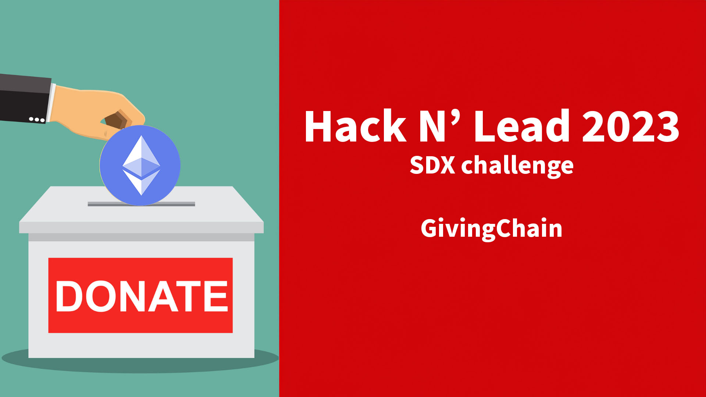
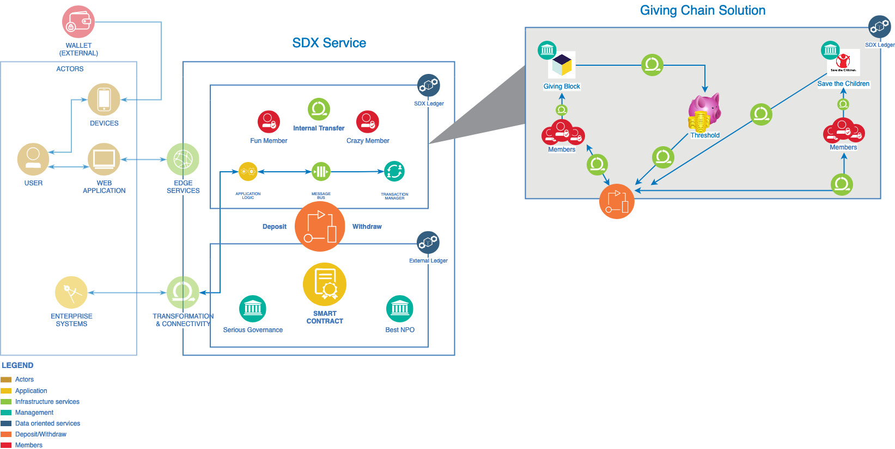

# GivingChain with SDX
Hack n Lead Hackathon SDX Challenge Team 4

Watch Demo Video: https://youtu.be/vOS9lkcpktI

## The Team
- Software Development Expert: [Anja Grafenauer](http://linkedin.com/in/anja-grafenauer)
- UX Designer: [Rebeca Perez](http://linkedin.com/in/beci-p-22270b291)
- Business Development Expert: [Vilma Ahumada](http://linkedin.com/in/vilmaahumada)
- Data Scientist: [Holly Capelo](http://linkedin.com/in/holly-l-capelo)
- Project Management: [Vanessa Wang](http://linkedin.com/in/vanessayingwang)

## Project Introduction
Our proposal for SDX is centered around crafting an innovative design for the application interface, facilitating seamless charity donations. Our goal extends beyond enhancing operational efficiency, seeking to embody a commitment to innovation, privacy, and positive social change.

Cryptocurrencies are increasingly embraced for transactions in today's society, with their applications extending beyond conventional usage. Both commercial and governmental bodies now leverage blockchain technology and cryptocurrency contributions. On donation platforms, alongside traditional methods like credit card details, crypto wallet information is commonly provided.

Unlike traditional donations, charities often face hurdles in accepting contributions from foreign countries. Cryptocurrencies enable global donations without the drawbacks of high fees, delays, or account blocking risks. The blockchain's transparency facilitates tracking funds to specific recipients, bolstering the credibility of charitable organizations.

## GivingChain Solution

## Current Stage of the App Implementation

So far, we have only been able to work on the frontend side of the application to display basic functionality or simple user interaction / interface.
We have built:
- A popup modal when a SDX member submits a deposit intent where he can select a charity organization (The Giving Block) and the amount of money he wants to donate. Note that currently, for lack of time and to fulfill demo purposes - a deposit will be triggered to go to the charity organization, which is not ideal. 
Ideally, donations would be using transfers via the SDX ledger until the charity has reached a threshold, and then the charity would be able to withdraw the funds to the Ethereum blockchain.
- A Donor settings page (only look / feel): the donor can set automatic donations of a specific amount of money on any transaction, or opt out of donations.
- A Charity settings page (only look / feel): the charity can set a threshold (to be implemented: once this thresfold of donated funds is reached, the charity can withdraw the funds to the Ethereum blockchain).

## Future Work

- Make sure that donations happen via transfers on the SDX ledger (to optimize costs) & make it dynamic (remove hardcoded addresses).
- Implement functionality for automatically setting donations on deposits, withdrawals and or transfers (mainly in the frontend).
- Implement functionality for charities to withdraw funds to the Ethereum blockchain once a threshold is reached.

