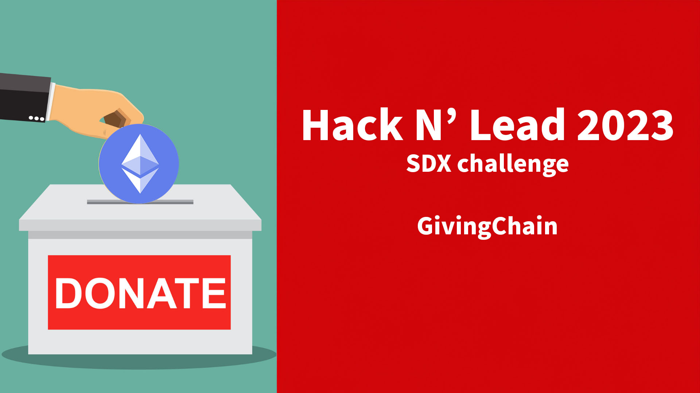

# GivingChain with SDX
Hack n Lead Hackathon SDX Challenge Team 4

## The Team
- Software Development Expert: [Anja Grafenauer](http://linkedin.com/in/anja-grafenauer)
- UX Designer: [Rebeca Perez](http://linkedin.com/in/beci-p-22270b291)
- Business Development Expert: [Vilma Ahumada](http://linkedin.com/in/vilmaahumada)
- Data Scientist: [Holly Capelo](http://linkedin.com/in/holly-l-capelo)
- Project Management: [Vanessa Wang](http://linkedin.com/in/vanessayingwang)

## Project Introduction
Our proposal for SDX is centered around crafting an innovative design for the application interface, facilitating seamless charity donations. Our goal extends beyond enhancing operational efficiency, seeking to embody a commitment to innovation, privacy, and positive social change.
<!---

--->

Cryptocurrencies are increasingly embraced for transactions in today's society, with their applications extending beyond conventional usage. Both commercial and governmental bodies now leverage blockchain technology and cryptocurrency contributions. On donation platforms, alongside traditional methods like credit card details, crypto wallet information is commonly provided.

Unlike traditional donations, charities often face hurdles in accepting contributions from foreign countries. Cryptocurrencies enable global donations without the drawbacks of high fees, delays, or account blocking risks. The blockchain's transparency facilitates tracking funds to specific recipients, bolstering the credibility of charitable organizations.
